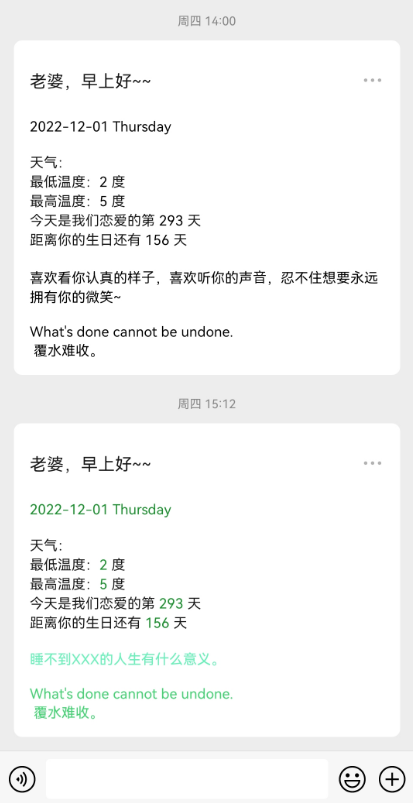

# 微信测试号——给女朋友的每日早安提醒
本程序基于golang，使用了silenceper/wechat/v2 go sdk工具包

效果如下：



第一步到[微信测试号](https://mp.weixin.qq.com/debug/cgi-bin/sandbox?t=sandbox/login)接口申请一个账号，扫码登录就可以获取，可以得到appID，appsecret的信息


呼叫你的女朋友🚺扫个码，能在后台获取到她的openid。

程序需要到[彩虹屁](https://www.tianapi.com/apiview/181)申请一个自己的api，获得一个自己的key

天气接口使用的是[百度天气](https://lbsyun.baidu.com/index.php?title=webapi/weather)，需要获取api的ak和女朋友所在地区的district_id：一般为当地的身份证前六位


第二步填写config.json

``

```json
{
  "mod": "",  //test为测试模式发送一条消息即关闭，prod为生产模式
  "cron": "30 7 * * *", //定时开启任务 每天的7：30
  "love_start_date": "xxxx-xx-xx",  //恋爱开始的日子 yyyy-mm-dd
  "birth_date": "xx-xx",  //生日的月 日  yy-dd
  "wechat_official": {
    "app_id": "",   //自己的appid
    "app_secret": "",  //自己的secretid
    "open_ids": [
      ""  她的openid
    ],
    "template_id": ""  //创建消息模板返回的模板id
  },
  "baidutianqi": {
    "ak": "", "" //百度天气ak
    "district_id": ""  //所在地区district_id
  },
  "colors": {
    "qinghua": "#550038" //默认颜色
  },
  "caihongpikey": "" //彩虹皮key
}
```


第三步：build然后运行，大功完成 **编译好的exe要和config.json放在一起**

```go
    go build main.go
```

